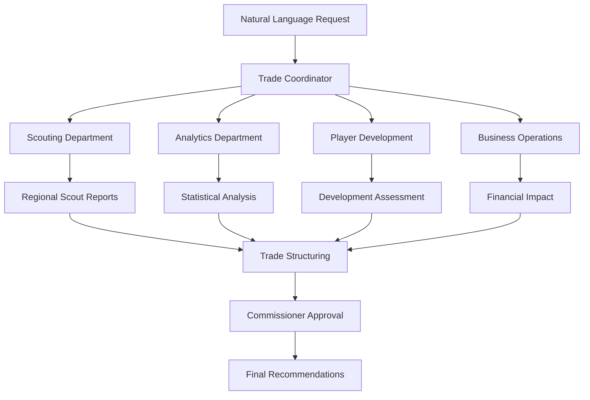

# Baseball Trade AI - Complete Front Office Simulation

A comprehensive MLB front office simulation using CrewAI that mirrors real baseball operations with specialized departments and all 30 team agents.

## 🏢 Complete Organizational Structure

### Front Office Hierarchy
- **Commissioner**: Ensures all trades follow MLB rules and regulations
- **Trade Coordinator**: President of Baseball Operations coordinating analysis
- **Assistant GM**: Handles logistics and day-to-day operations

### 🔍 Scouting Department
- **6 Regional Pro Scouts**: Complete coverage of all MLB divisions
  - AL East, AL Central, AL West
  - NL East, NL Central, NL West
- **International Scout**: Global talent evaluation and cultural insights
- **Amateur Scout**: Draft prospects and college talent assessment

### 📊 Analytics Department
- **Statcast Analyst**: Modern metrics (exit velocity, spin rate, barrel %)
- **Traditional Stats Analyst**: Classic baseball statistics and context
- **Projection Analyst**: Multi-year performance forecasting
- **Defensive Metrics Analyst**: Advanced defensive evaluation
- **Matchup Analyst**: Situational performance and platoon analysis

### 🎯 Player Development Team
- **Minor League Coordinator**: Prospect development and ETA assessment
- **Player Development Analyst**: Skill improvement potential evaluation
- **Biomechanics Expert**: Injury risk and mechanical efficiency analysis
- **Mental Performance Coach**: Makeup, coachability, and pressure handling

### 💼 Business Operations
- **Salary Cap Strategist**: Multi-year financial planning and luxury tax
- **Marketing Impact Analyst**: Star power, ticket sales, and revenue impact
- **Media Relations Advisor**: PR implications and public perception management
- **Revenue Analyst**: Comprehensive financial impact including playoff revenue
- **Legal Advisor**: Contract compliance and MLB regulation adherence

### ⚾ All 30 MLB Team Agents
Each team has unique characteristics:
- **Organizational Philosophy**: Win-now vs. rebuild, analytics vs. traditional
- **Financial Constraints**: Payroll limits and luxury tax considerations
- **Competitive Timeline**: Current window and future planning
- **Historical Biases**: Proven veterans vs. young talent preferences
- **Geographic Factors**: Market size, media pressure, ballpark effects

## 🚀 How It Works

### Natural Language Processing
Input: `"I need a power bat with OPS over .900"`

The system:
1. **Parses** the request to understand specific needs
2. **Coordinates** all departments for comprehensive analysis
3. **Structures** realistic trade proposals
4. **Validates** MLB rule compliance
5. **Delivers** complete organizational recommendations

### Multi-Agent Workflow


## 📋 Installation & Setup

### Prerequisites
- Python 3.11+
- OpenAI API key
- Supabase account (for database)

### Quick Start
```bash
# Clone the repository
git clone <repository-url>
cd MLB_trade_analyzer

# Create virtual environment
python -m venv venv
source venv/bin/activate  # On Windows: venv\Scripts\activate

# Install dependencies
pip install -r requirements.txt

# Set up environment variables
cp .env.example .env
# Edit .env with your API keys

# Run the application
python -m backend.main
```

### Environment Variables
```bash
OPENAI_API_KEY=your_openai_key
SUPABASE_URL=your_supabase_url
SUPABASE_SERVICE_KEY=your_supabase_key
REDIS_URL=your_redis_url  # Optional
```

## 🎯 API Usage Examples

### Start Complete Analysis
```bash
POST /api/analyze-trade
{
  "team": "yankees",
  "request": "I need a starting pitcher with ERA under 3.50 who can eat innings",
  "budget_limit": 25000000,
  "include_prospects": true
}
```

### Quick Analysis
```bash
POST /api/quick-analysis
{
  "team": "dodgers", 
  "request": "Looking for a power bat to help in the playoffs"
}
```

### Check Analysis Status
```bash
GET /api/analysis/{analysis_id}
```

### Example Natural Language Requests

**Power Hitting**
- "Find me a slugger with 30+ home run power"
- "Need a middle-of-the-order bat with OPS over .850"
- "Looking for right-handed power for Yankee Stadium"

**Starting Pitching**
- "I need a front-of-rotation starter for a playoff push"
- "Find a durable starter who can give us 180+ innings"
- "Looking for a lefty starter with good control"

**Relief Pitching**
- "Need a closer who can handle high-leverage situations"
- "Find a setup man with good stuff against righties"
- "Looking for bullpen depth with multiple years of control"

**Positional Needs**
- "Need a shortstop with good defense and some pop"
- "Looking for a catcher who can frame and call games"
- "Find a center fielder with speed and range"

**Prospect-Focused**
- "Interested in young talent with high ceilings"
- "Looking for prospects who are close to MLB ready"
- "Need organizational depth in the outfield"

## 🏗️ System Architecture

### CrewAI Multi-Agent Coordination
The system uses CrewAI's hierarchical process with the Trade Coordinator as manager, ensuring:
- **Proper task sequencing** across departments
- **Information flow** between specialized agents
- **Consensus building** for final recommendations
- **MLB compliance** at every step

### Realistic Baseball Operations
Each agent is designed with:
- **Domain expertise** specific to their role
- **Realistic constraints** based on MLB operations
- **Historical context** and organizational memory
- **Collaborative decision-making** processes

### Advanced Features
- **Multi-team trade scenarios** when beneficial
- **Salary matching** and financial optimization
- **Prospect protection** and Rule 5 considerations
- **Timeline management** for trade deadlines
- **Risk assessment** and contingency planning

## 📊 Example Output

### Comprehensive Analysis Result
```json
{
  "analysis_id": "uuid-here",
  "team": "yankees",
  "original_request": "I need a power bat",
  "recommendations": [
    {
      "priority": 1,
      "player_target": "Pete Alonso",
      "position": "First Base",
      "current_team": "Mets",
      "trade_package": ["Jasson Dominguez", "Spencer Jones", "$10M cash"],
      "organizational_consensus": "Strong support across all departments",
      "key_benefits": [
        "Immediate power upgrade (40+ HR potential)",
        "Proven in New York market",
        "Team control through 2025"
      ],
      "risks": [
        "High strikeout rate",
        "Limited defensive value",
        "Division rival reluctance"
      ],
      "scouting_report": "Elite raw power, struggles vs premium velocity",
      "analytics_summary": "xwOBA suggests sustainable power production",
      "financial_impact": {
        "salary_added": 20000000,
        "luxury_tax_impact": 22000000,
        "playoff_revenue_upside": 15000000
      },
      "implementation_plan": "Approach Mets with package, expect negotiation"
    }
  ],
  "departments_consulted": [
    "Front Office Leadership",
    "Scouting Department",
    "Analytics Department", 
    "Player Development",
    "Business Operations",
    "Team Management", 
    "Commissioner Office"
  ]
}
```

## 🔧 Customization

### Adding New Teams
Extend `TeamGMAgents` class with unique team characteristics:
```python
@staticmethod
def create_new_team_gm() -> Agent:
    return Agent(
        role="New Team General Manager",
        goal="Team-specific goals and constraints",
        backstory="Unique organizational philosophy...",
        tools=[roster_tool, salary_tool, team_needs_tool]
    )
```

### Custom Analysis Tools
Add specialized tools in the `tools/` directory:
```python
@tool
def custom_analysis_tool(player_name: str) -> Dict[str, Any]:
    """Custom analysis logic"""
    return analysis_results
```

## 🧪 Testing

Run the test suite:
```bash
pytest tests/ -v
```

Test specific components:
```bash
pytest tests/test_agents.py -v
pytest tests/test_nlp.py -v
pytest tests/test_api.py -v
```

## 🚀 Deployment

### Docker
```bash
docker build -t baseball-trade-ai .
docker run -p 8000:8000 baseball-trade-ai
```

### Production Considerations
- Use Redis for analysis state management
- Implement proper authentication
- Add rate limiting
- Configure monitoring and logging
- Set up database connection pooling

## 🤝 Contributing

1. Fork the repository
2. Create feature branch (`git checkout -b feature/amazing-feature`)
3. Commit changes (`git commit -m 'Add amazing feature'`)
4. Push to branch (`git push origin feature/amazing-feature`)
5. Open Pull Request

## 📜 License

This project is licensed under the MIT License - see the LICENSE file for details.

## 🙏 Acknowledgments

- **CrewAI** for the multi-agent framework
- **OpenAI** for language model capabilities
- **Baseball Reference** for statistical inspiration
- **MLB front offices** for organizational structure insights

---

## 🎯 Key Features Summary

✅ **Complete Front Office Simulation** - All departments represented  
✅ **Natural Language Processing** - Understand complex trade requests  
✅ **30 Unique Team Agents** - Realistic organizational differences  
✅ **MLB Rule Compliance** - Commissioner ensures legal trades  
✅ **Multi-Department Coordination** - Just like real baseball operations  
✅ **Financial Analysis** - Luxury tax and salary cap considerations  
✅ **Prospect Evaluation** - Development timelines and potential  
✅ **Business Impact** - Marketing, PR, and revenue implications  
✅ **Realistic Trade Structures** - Balanced, executable proposals  
✅ **Comprehensive Documentation** - Easy to understand and extend  

**Transform "I need a power bat" into a complete organizational analysis with realistic trade recommendations!** ⚾🚀